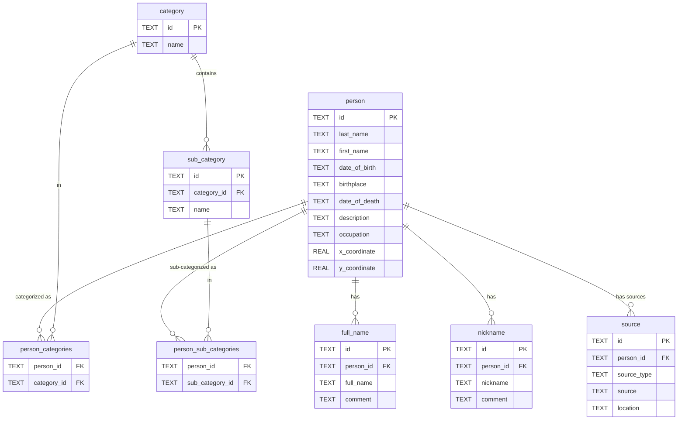

# Kaardirakendus - Eesti avalike tegelaste sünnigeograafia

Using vanillaJS in the client side and Fastify(TS) + MikroORM + SQLite in the server side. By default, firewall rules are configured to only allow traffic from Estonian IPs.

## Running the application locally
Create a database and add the hostname (sqlite_database.db) to `.env`

[Create tables](./src/assets/sql/create_tables.sql) inside the created db and then add [categories and sub-categories](./src/assets/sql/categories_and_sub-categories.sql)

**Local development**
Run `npm run start:dev` for development environment. Can set up your own API key in the `.env` file (project root).

**Build Docker image**
- **ARM:** Run `docker build -t geo-estonia-public-figs/prod .` in the projects root directory.
- **X64:** Run `docker build --platform linux/amd64 --no-cache -t geo-estonia-public-figs/prod .` in the projects root directory.

## Running the application via docker
Run with:
```shell
docker run -p 3001:3001 -v $(pwd)/kaardirakendus.db:/app/kaardirakendus.db -e NODE_ENV=production --env-file .env --name kaardirakendus-backend geo-estonia-public-figs
```

Mounts the database volume. There isn't any migration tools set upped, so exec into docker container and run the [sql scripts](./src/assets/sql/)

### SQLite configs

[//]: # (TODO automate the sqlite database stuff)

Download UUIDv4 extension:
```shell
wget -qO- "https://github.com/woile/sqlite-uuid/releases/download/0.4.0/libsqlite_uuid-$(uname -s)-$(uname -m).tar.gz" | tar xvz

# add to path
sudo mv libsqlite_uuid.so /usr/lib/

# load the plugin with each session
vim ~/.sqliterc
# add this line to file created above
.open database_name .db
.load libsqlite_uuid 
```

## Configuring a firewall
Solid and short explanation of [nftables](https://www.youtube.com/watch?v=83_M2NRgUtg) <br>
Can set up in the cloud providers UI. In this case using CLI for it (VM running on Debian 12 bookworm). Both `iptables` and `nftables` are possible options, using `nftables` in this instance:

Install `nftables`
```shell
sudo apt update
sudo apt install nftables
```

Enable `nftables`
```shell
# check status, if stopped or disabled, then enable and start
sudo systemctl status nftables

sudo systemctl start nftables
sudo systemctl enable nftables
```

Sample `nftables` ruleset file
```shell
#!/usr/sbin/nft -f

#
# table declaration
#
add table filter

table filter {
  chain incoming {
    type filter hook input priority 0; policy drop;
    
    # icmp
    icmp type echo-request accept
    
    # open tcp ports: sshd (22), httpd (80)
    tcp dport { ssh, http, https } accept
  }
}
```

Create `nftables` script
```shell
# copy contents from /scripts/create_nftables_estonian_ips_whitelist.sh
sudo vim create_nftables_estonian_ips_whitelist.sh

# give permissions and run the script
sudo chmod 744 create_nftables_estonian_ips_whitelist.sh
sudo ./create_nftables_estonian_ips_whitelist.sh

# make sure everything went alright, stdin the ruleset
sudo nft list ruleset

# see that the ruleset exists in /etc/nftables (press tab)
ls /etc/nftables #press tab
# nftables.conf           nftables_estonian.conf

# include the newly created conf to `nftables.conf` to persist the ruleset. Add the statement to the end of the file (right after the last curly bracket '}')
include "/etc/nftables_estonian.conf"

# reload the nftables conf
sudo systemctl reload nftables
```

## Database schema


## Reflection on project testing at a school
The application load times were very slow, the VPS in question used a single core CPU with 4GB of RAM. The number of concurrent connections ranged between 20 and 25. 

In my opinion the server's computing resources weren't a bottleneck during testing, but non optimized code which used slow SQL queries for the most important application business logic. 

Secondly as soon as the amount of concurrent connections arose probably over 20, `Knex` (Query Builder) used by `MikroORM` failed, where apparently the connection pool was full, sample error message:  
```shell
Error in /person/search route: KnexTimeoutError: Knex: Timeout acquiring a connection. The pool is probably full. Are you missing a .transacting(trx) call?
    at SqliteKnexDialect.acquireConnection (/app/node_modules/knex/lib/client.js:332:26)
    at runNextTicks (node:internal/process/task_queues:60:5)
    at listOnTimeout (node:internal/timers:545:9)
    at process.processTimers (node:internal/timers:519:7)
    at async Runner.ensureConnection (/app/node_modules/knex/lib/execution/runner.js:305:28)
    at async Runner.run (/app/node_modules/knex/lib/execution/runner.js:30:19)
    at async executeQuery.query (/app/node_modules/@mikro-orm/knex/AbstractSqlConnection.js:119:25)
    at async SqliteConnection.executeQuery (/app/node_modules/@mikro-orm/core/connections/Connection.js:102:25)
    at async QueryBuilder.execute (/app/node_modules/@mikro-orm/knex/query/QueryBuilder.js:631:21)
    at async QueryBuilder.getResultList (/app/node_modules/@mikro-orm/knex/query/QueryBuilder.js:669:21) {
  sql: 'select `person`.`id`, `person`.`first_name`, `person`.`last_name`, `person`.`occupation`, `person`.`date_of_birth`, `person`.`date_of_death`, `person`.`x_coordinate`, `person`.`y_coordinate`, `person`.`description`, `nicknames`.`id` as `nicknames__id`, `nicknames`.`nickname` as `nicknames__nickname`, `nicknames`.`comment` as `nicknames__comment`, `nicknames`.`person_id` as `nicknames__person_id`, `categories`.`id` as `categories__id`, `categories`.`name` as `categories__name`, `sub_categories`.`id` as `sub_categories__id`, `sub_categories`.`name` as `sub_categories__name`, `sub_categories`.`category_id` as `sub_categories__category_id` from `person` as `person` left join `nickname` as `nicknames` on `person`.`id` = `nicknames`.`person_id` left join `person_categories` as `p1` on `person`.`id` = `p1`.`person_id` left join `category` as `categories` on `p1`.`category_id` = `categories`.`id` left join `person_sub_categories` as `p2` on `person`.`id` = `p2`.`person_id` left join `sub_category` as `sub_categories` on `p2`.`sub_category_id` = `sub_categories`.`id` where (CAST(SUBSTR(person.date_of_birth, -4, 4) AS INTEGER) >= 1991)',
  bindings: undefined
}
```

```shell
Error in /person/name route: KnexTimeoutError: Knex: Timeout acquiring a connection. The pool is probably full. Are you missing a .transacting(trx) call?
    at SqliteKnexDialect.acquireConnection (/app/node_modules/knex/lib/client.js:332:26)
    at runNextTicks (node:internal/process/task_queues:60:5)
    at listOnTimeout (node:internal/timers:545:9)
    at process.processTimers (node:internal/timers:519:7)
    at async Runner.ensureConnection (/app/node_modules/knex/lib/execution/runner.js:305:28)
    at async Runner.run (/app/node_modules/knex/lib/execution/runner.js:30:19)
    at async executeQuery.query (/app/node_modules/@mikro-orm/knex/AbstractSqlConnection.js:119:25)
    at async SqliteConnection.executeQuery (/app/node_modules/@mikro-orm/core/connections/Connection.js:102:25)
    at async Object.<anonymous> (file:///app/dist/modules/person/person.routes.js:73:29) {
  sql: '\n' +
    '        SELECT\n' +
    '          person.x_coordinate as xCoordinate,\n' +
    '          person.y_coordinate as yCoordinate,\n' +
    '          person.first_name AS firstName,\n' +
    '          person.last_name AS lastName,\n' +
    "          GROUP_CONCAT(nickname.nickname, ', ') AS nicknames\n" +
    '        FROM person\n' +
    '               LEFT JOIN nickname ON person.id = nickname.person_id\n' +
    '        WHERE\n' +
    "          LOWER(person.first_name) LIKE '%mu%'\n" +
    "           OR LOWER(person.last_name) LIKE '%mu%'\n" +
    "           OR LOWER(nickname.nickname) LIKE '%mu%'\n" +
    '        GROUP BY person.id\n' +
    '          LIMIT 15;\n' +
    '      ',
  bindings: undefined
}
```